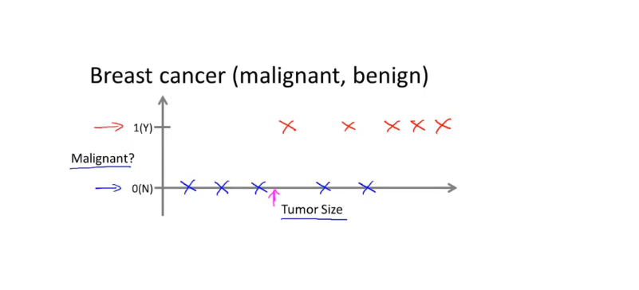
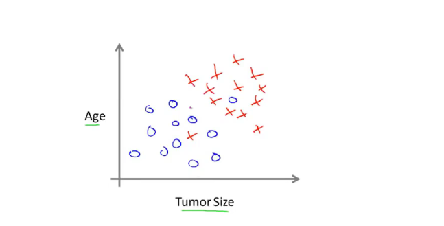
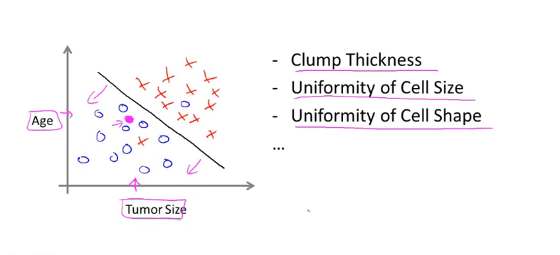
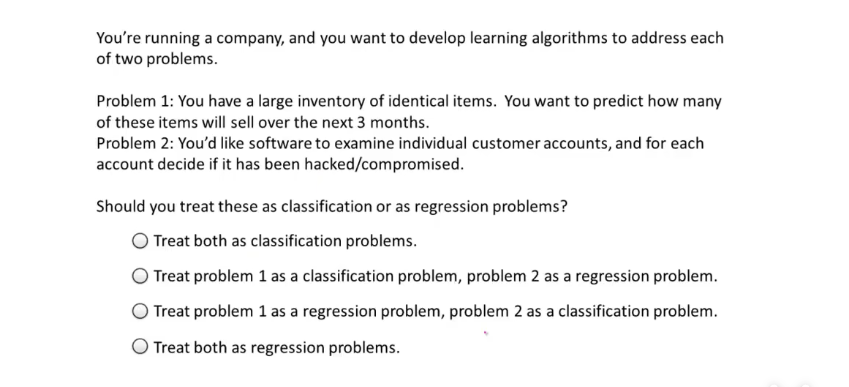

# 监督学习

### 例子1

        我们给算法一个数据集，其中包含了正确答案，假如我们给它一个房价数据集，这个数据集中的每个样本，我们都给出正确的价格，就是这个房子的实际卖价，算法的目的是得出更多的正确答案。更专业的说法是回归问题**。这里的回归问题是指，我们想要预测连续的数值输出**，也就是价格，从技术上而言，价格可以被圆分解到分，价格是一个离散值。但通常我们认为房价是一个实数，标量或者是连续值。

回归这个术语是指，我们设法预测连续值的属性。

### 例子2

假如你想看医疗记录，并且想要设法预测乳腺癌是恶性的还是良性的。假设某人发现了一个乳腺肿瘤，恶性肿瘤是有危险的，假如在你的数据集中，横轴是肿瘤的尺寸，纵轴用1或者0代表是或者否。如下图：

        机器学习的问题是，你能否估计出肿瘤是良性的还是恶性的概率。用专业的术语说，这是一个分类问题，我们设法预测一个离散值输出 0或者1，恶性或者良性。 

        在实际问题中，有时你也有两个以上的可能的输出值，在实际的例子中，可能有三种类型的乳腺癌，因此你可能要设法预测离散值，0，1，2或者3，0是良性，1，2，3分别代表3种癌症，这也是一个分类问题，因为这又是一组离散的输出值，对应于没有癌症，或者癌症1

在分类问题中，有另外一种方法来绘制这些数据，我用一组不同的符号俩绘制这组数据，肿瘤的大小是用来预测恶性或者良性的特征，我将用不同的符号来表示良性或者恶性。

这个例子中，只用了一个特征（属性），就是肿瘤的大小，来预测肿瘤是良性的，还是恶性的

### 例子3

假设我们不仅知道肿瘤的大小，还知道病人的年纪，如下图

在给定的数据集上，学习算法能做的就是在数据上画出一条线，设法将恶性和良性瘤分开，学习算法可能决定，用直线来分离这两类。如下图：

有趣的算法不仅能处理2，3或者5个特征的，而是可以处理无穷多特征的算法。

如何来处理无穷多的特征呢，如何在计算机种存储无穷多数量的事物，你的计算机内存可能会溢出，以支持向量机为例子，就有个灵活的数据技巧，允许计算机处理无穷多的特征，

可以写一个算法来处理无穷多的特征。


  

  

#### 概述：

在监督学习中，我们想要算法预测，并给出正确答案，像房子可以卖出的价格，或者肿瘤是恶性的还是良性的。

也讨论到了回归问题。 回归是我们的目标，是预测一个连续值的输出。我们还讨论了分类问题，其目的是预测离散值的输出。

#### 检查：

如下图

选第三个，问题1是**回归问题**，几千件货物，我会将他看作一个实数，就是一个连续的值，

问题2是**分类问题**，因为我看你会设置我要预测的值是0，表示账户没有被入侵，设置为1，表示账户被入侵，并用一个算法来预测，因为只有少量的离散值，我们把它归为一个分类问题。

